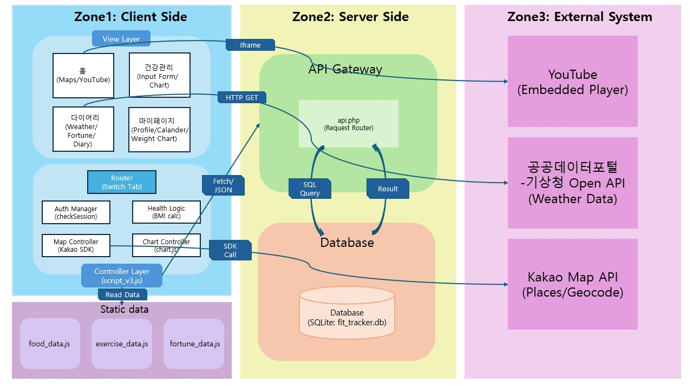

# [웹응용프로그래밍|텀프로젝트] 최종 보고서 : Fit-Tracker

## 1. 웹 서비스 주제

### 1.1. 프로젝트명
- Fit-Tracker

### 1.2. 프로젝트 주제 및 개요
사용자의 신체 데이터를 기반으로 개인 맞춤형 건강 관리를 돕는 올인원 헬스케어 웹 서비스입니다. 체계적인 기록과 데이터 시각화, 그리고 위치 기반 편의 기능을 통합하여 사용자가 지속 가능한 건강 관리를 할 수 있도록 지원합니다.

### 1.3. 핵심 기능
- 개인 신체 정보 분석
  - 사용자 키와 체중 데이터를 바탕으로 BMI(체질량지수) 자동 계산
  - 체중 변화 추이를 그래프로 시각화하여 제공
- 칼로리 매니지먼트
  - 일일 식단과 운동 내용 기록 시 섭취 및 소모 칼로리 자동 계산
  - 권장 대사량 대비 달성률을 도넛 차트로 직관적으로 표시
- 위치 기반 시설 검색
  - GPS 및 카카오맵 API 연동
  - 사용자 주변의 운동 시설(헬스장, 수영장, 공원 등) 위치와 정보 제공
- 라이프 스타일 케어
  - 기상청 데이터를 활용한 주간 날씨 확인
  - 오늘의 운세 등 부가 기능을 통한 재방문 유도

---

## 2. 주제 선정 배경 및 이유

### 2.1. 주제 선정 배경
최근 '헬시 플레저(Healthy Pleasure)' 트렌드 확산과 함께 건강 관리에 대한 사회적 관심이 급증하고 있습니다. 이에 따라 단순한 체중 감량을 넘어, 자신의 식습관과 활동량을 데이터로 기록하고 체계적으로 관리하려는 수요가 늘어나고 있습니다.

### 2.2. 주제 선정 이유
기존의 건강 관리 방식은 식단, 운동 기록, 체중 변화, 주변 시설 정보가 여러 플랫폼에 파편화되어 있어 통합 관리에 어려움이 있었습니다. 본 프로젝트는 '기록(Log) - 분석(Analyze) - 정보(Info)'를 하나의 웹 서비스에서 해결하여 진입 장벽을 낮추고 꾸준한 건강 관리를 돕는 것을 목표로 합니다.

---

## 3. 개발 언어 및 사용 도구

| 구분 | 사용 도구 |
|------|--------|
| Frontend | HTML, CSS, JavScript |
| Backend | PHP |
| Database | SQLite |
| External APIs | Kakao Map API, 공공데이터포털 |
| Libraries | Chart.js |
| Infra/Tool | XAMPP, VS Code, Github |

---

## 4. 전체 시스템 개요도 및 설명

### 4.1. 전체 시스템 개요도

### 4.2. 전체 시스템 동작 방식

#### 4.2.1. 시스템 개요

- Fit-tracker는 사용자의 건강, 운동, 식단을 기록하고 외부 API를 활용해 날씨 및 주변 시설 정보를 제공하는 웹 기반 헬스케어 서비스입니다. 전체적으로 SPA(Single Page Application)와 유사한 구조를 띄며, 탭(Tab) 전환을 통해 화면을 갱신하고 fetch API를 통해 비동기로 서버와 통신합니다.

#### 4.2.2. 구역별 상세 동작 방식

**Zone 1: Client Side (사용자 인터페이즈 및 로직)**

사용자가 웹 브라우저를 통해 서비스를 이용하는 영역입니다.

- View Layer (화면 구성)
  - 구조 : `index.php` 를 메인 프레임으로 하여, `home.php`, `health.php`, `diary.php`, `mypage.php` 가 탭 형태(`tabs`)로 포함되어 있습니다.
  - Router (화면 전환) : 브라우저의 페이지 이동 없이 `script_v3.js` 의 `switchTab()` 함수를 통해 보여줄 `div` 영역만 활성화/비활성화 처리하여 빠른 반응 속도를 제공합니다.

- Controller Layer (핵심 로직 - `script_v3.js`)
  - Auth Manager (인증 관리) : 앱 실행 시 `checkSession()` 을 통해 `api.php` 에 로그인 여부를 묻고, 결과에 따라 로그인 화면 또는 메인 앱 화면을 표시합니다.
  - Health Logic (건강 로직) : 사용자 신체 정보(키, 체중, 나이)를 기반으로 BMI 및 권장 칼로리를 계산하고, 식단/운동 데이터를 관리합니다.
  - Map Controller (지도 제어) : `Kakao Map SDK` 를 이용해 사용자의 현재 위치를 추적하여 주변 운동 시설(헬스장, 공원 등)을 검색하여 마커로 표시합니다.
  - Chart Controller (차트 시각화) : `Chart.js` 를 사용하여 데이터 시각화를 담당하는 컨트롤러 입니다.
    - 체중 그래프 : `weight_logs` 데이터를 기반으로 기간별(1개월, 3개월 등) 체중 변화를 선형 그래프로 나타냅니다.
    - 칼로리 차트 : `daily_logs` 의 섭취/소모 칼로리 데이터를 계산하여, 목표 대비 현황을 도넛 차트 형태로 나타냅니다.

- Static Data (정적 데이터)
  - 음식(`food_data.js`), 운동(`exercise_data.js`), 운세(`fortune_data.js`) 데이터는 클라이언트에 내장되어 있어 빠른 자동완성 검색과 운세 생성을 지원합니다.

**Zone 2: Server Side (데이터 처리 및 저장)**

클라이언트의 요청을 받아 로직을 수행하고 데이터를 저장하는 영역입니다.

- API Gateway (`api.php`)
  - 클라이언트로부터 JSON 형식의 요청을 받아, 요청된 `action` (로그인, 저장, 조회 등) 에 맞는 로직으로 라우팅합니다.

- Database (SQLite)
  - `fit_tracker.db` 파일 데이터베이스를 사용하여 사용자 정보, 운동/식단 기록, 일기, 체중 데이터를 영구적으로 저장하고 관리합니다.

**Zone 3: External System (외부 연동)**

시스템 내부 데이터 외에 필요한 정보나 기능을 제공하기 위해 외부 API를 활용합니다.

- Kakao Map API : 지도 출력, 주소 검색, 카테고리별 장소 검색 기능을 제공합니다.

- 공공데이터포털 (기상청 API) : 사용자의 위치(격자 좌표 변환)를 기반으로 실시간 날씨 및 주간 예보 정보를 받아옵니다.

- Youtube : 운동 관련 추천 영상을 임베디드 플레이어 형태로 제공합니다.

---

## 5. 팀 멤버 별 담당 업무

- 김수민 (202355523)

| 담당 업무 | 상세 내용 |
|------|------|
| 웹사이트 페이지 구성 | 전체 UI/UX 디자인 및 통합 레이아웃 작업 |
| 다이어리 탭 구현 | 전체 탭 화면 및 기능 구현 |
| 마이페이지 탭 구현 | 프로필 정보 편집, 캘린더/체중변화그래프 렌더링 |

- 오소현 (202455358)

| 담당 업무 | 상세 내용 |
|------|------|
| 홈 탭 구현 | 대시보드 화면 및 유튜브 영상 임베드 |
| 지도 기능 구현 | 카카오맵 연동, 위치 검색, 주변 시설 마커 |
| 페이지 구성 & 체중 그래프 | 로그인 상태 관리, 탭 전환 로직, 그래프 필터 구현 |

- 장다은 (P2023007246)

| 담당 업무 | 상세 내용 |
|------|------|
| 백엔드 & DB 구축 | SQLite DB 스키마 설계, API 연동 로직 구현 |
| 회원 관리 & 건강 관리 탭 구현 | 인증/세션 관리, 건강 관리 전체 탭 화면 및 기능 구현 |
| 테스트 환경 구축 | 초기 테스트 및 시연용 가상 데이터 생성 |

---

**깃허브 주소 : https://github.com/min3517/WEB_APPLICATION_PROGRAMMING-Fit-Tracker**

---
